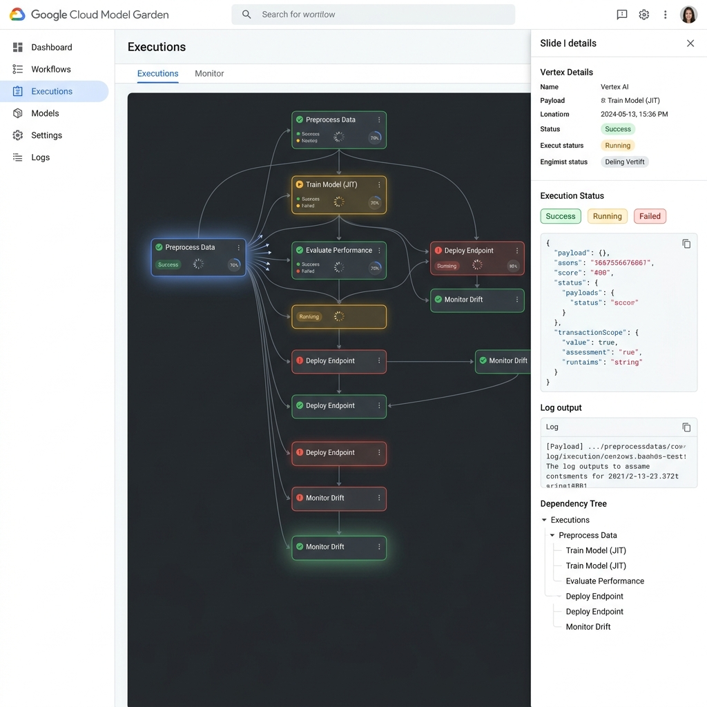

# ADR-006: Console UI for JIT-DAG Visualization and Monitoring

## Status
Proposed

## Context
Flory orchestrates dynamic, JIT-generated DAGs where vertices (Planners, Tool Callers, and Routers) are appended progressively based on runtime execution. As workflows increase in complexity (e.g., nesting planners, evaluating conditional router policies, and executing distributed transactions), it becomes impossible to debug or monitor the system solely by reading the raw append-only `event_log`.

We need a dedicated Console UI to visualize these workflows in real-time. The goal is to provide operators and developers with a clear, interactive visual representation of the DAG, deeply integrated with Flory’s transaction safety and replay mechanics.

## Proposed Decision
Design and implement the **Flory Console**, a web-based UI inspired by the design language of GCP's Vertex AI Model Garden. The console will adopt a Google Material Design layout that **must support automatic light/dark theme adaptability**, aligning with the repository's convention for diagrams.

*(Note: Upon acceptance of this ADR, this style guideline and the mockup image below will be merged into an authoritative design document to prevent the asset from becoming an orphan.)*



### 1. Interactive JIT-DAG Canvas (Main View)
- **Vertex AI Node Styling:** Vertices will be rendered as Material Design cards. Each card will feature a left-edge color indicator (e.g., Green for Success, Amber for Running, Red for Failed) and standard GCP material icons denoting the node type (Planner, Tool, Router).
- **Dynamic JIT Expansion:** The canvas dynamically "grows" in real-time. When the TypeScript Engine appends `subgraph/frozen` to the event log, the corresponding parent node on the canvas visually unfolds its subsequent branches with smooth layout animations, natively supporting progressive disclosure.
- **Transaction Scope Boundaries:** The canvas uses subtle background dash-boxes or vertical division lines (adapting their neutral ink to the current theme) to explicitly demarcate `txn/pivot-passed` boundaries. 
- **Canvas Controls:** Includes standard Vertex AI pipeline controls (Zoom in/out, Pan, Fit-to-screen, and a collapsible Mini-map in the bottom-right corner).

### 2. Vertex Inspector (Right Slide-out Drawer)
Consistent with GCP consoles, clicking any vertex does not open a modal, but rather triggers a right-side slide-out drawer. The drawer organizes dense information using tabs:
- **'Details' Tab:** Shows execution status badges, node execution duration, and metadata.
- **'Payload' Tab (JSON View):** 
  - *For Planners:* Displays the assembled prompt and the raw LLM completion.
  - *For Tool Callers:* Displays the exact input parameters and the JSON result returned by the Go Coordinator.
  - *For Routers (Policy Engine):* Displays the exact rule condition matched to trigger the route.
- **'Logs' Tab:** Streams raw execution logs specific to that vertex (e.g., standard output from the Go Executor).

### 3. Data Binding & Dedicated Backend Console Read Model
The UI does not maintain its own state database, nor does it fold events itself. Per the core architecture (Doc 01 §4), implementing a second fold pipeline in the browser is strictly forbidden. The Console is strictly a **dumb renderer**.

However, the existing LLM-facing `surface()` projection (which discards `shadowed` vertices and omits timestamps/scopes to conserve context tokens) is insufficient for visual monitoring. To supply the promised UI features without front-end re-computation, the TypeScript Engine exposes a dedicated, versioned **`ConsoleDAGProjection`** read model alongside on-demand detail endpoints:

#### 3.1 Backend `ConsoleDAGProjection` Contract
The backend projects an enriched observability model streamed via Server-Sent Events (SSE) or WebSocket:
- **Historical & Shadowed Vertex Preservation:** Unlike the context projector, the Console projection retains `shadowed` vertices (flagged with `is_shadowed: true`). The UI renders them greyed-out with dashed edges, allowing operators to visually inspect replanning history and discarded branches.
- **Transaction & Timing Metadata:** Every vertex card payload is enriched with:
  ```jsonc
  {
    "vertex_id": "v-1234",
    "role": "tool",
    "status": "succeeded",
    "is_shadowed": false,
    "txn": {
      "scope_id": "txn-7f3a",
      "is_pivot": true,
      "effect_class": "irreversible"
    },
    "timing": {
      "started_at": "2026-09-08T12:00:00.120Z",
      "completed_at": "2026-09-08T12:00:00.340Z",
      "duration_ms": 220
    },
    "router_outcome": { "matched_condition": "amount > 100" } // for router vertices
  }
  ```
- **Streaming Semantics:** The backend streams full initial DAG snapshots on connection, followed by lightweight incremental vertex status updates (`vertex_patched`) as events append.

#### 3.2 On-Demand Detail Endpoints (Heavy I/O Offloading)
To keep streaming DAG payloads under tight bandwidth limits, heavy debugging data is not embedded in the graph stream. The Console Drawer lazily queries dedicated REST endpoints when a user clicks a vertex:
- `GET /api/v1/runs/:runId/vertices/:vertexId/prompt`: Fetches the fully assembled prompt and raw LLM response.
- `GET /api/v1/runs/:runId/vertices/:vertexId/logs`: Streams or fetches execution stdout/stderr logs directly from blob storage.
- `GET /api/v1/runs/:runId/vertices/:vertexId/payload`: Fetches full inputs/outputs exceeding the event log size limit.

## Rationale
- **Preserves Single Projector Law:** The browser never touches raw events or runs graph algorithms. All structural folding, scope derivation, and shadow tracking remain authoritative in the TypeScript Engine.
- **Cognitive Load:** The Vertex AI style is proven for handling complex machine-learning and orchestration pipelines. Retaining shadowed branches makes replanning intuitive rather than confusingly disappearing nodes.
- **Bandwidth Efficiency:** Separating the streaming DAG topology from heavy raw logs and prompts ensures the main canvas remains ultra-responsive even during peak 1k TPS bursts.

## Consequences
- **Backend Read Model:** The TypeScript Engine will maintain a dedicated `ConsoleProjector` implementation alongside the canonical `SurfaceProjector`.
- **Detail APIs:** Requires implementing read endpoints in the Engine gateway to fetch large payloads and logs from blob storage.

## Rejected Alternatives
- **Command-Line Interface (CLI) Only:** While a CLI is useful for triggering runs, it is insufficient for visualizing a branched, nested, running DAG and diagnosing complex pivot/compensation states.
- **Using Existing Tools (e.g., Argo Workflows UI or Airflow UI):** These tools assume statically defined workflows at submission time. Flory's JIT-DAG structure, where the graph shape is unknown until an LLM or Router decides it, cannot be mapped cleanly into standard static DAG visualizers. A custom Console is required to handle progressive disclosure natively.
