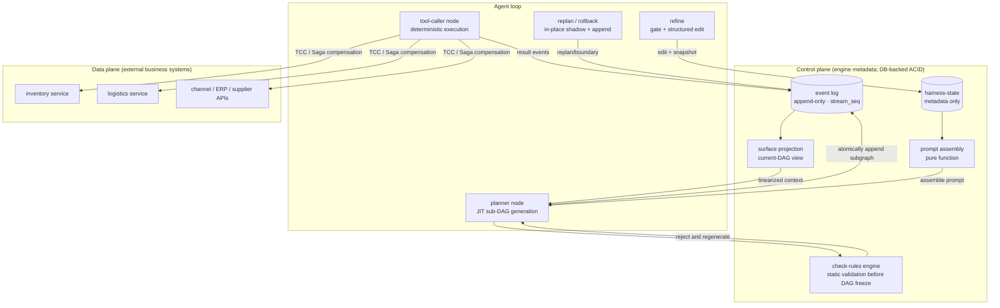

# Flory Design Overview (00)

> Status: Draft v0.1 | 2026-08-15 | Entry point and terminology baseline for the `doc/design` series

## 1. What Flory Is

Flory is an AI harness orchestration engine for AI-driven e-commerce. It supports end-to-end AI deployment from suppliers (product selection, procurement, and inventory) to sales channels (pricing, listing, orders, and logistics).

Its central challenge is that **LLM planning is probabilistic, while inventory decrements and logistics bookings are irreversible**. Flory is therefore not another agent framework: it joins JIT dynamic planning and distributed-transaction discipline on one execution substrate.

## 2. Core Concepts

| Concept | One-sentence definition | Details |
|---|---|---|
| JIT-DAG | An execution DAG generated incrementally by a planner in the ReAct style, using progressive disclosure. | [01](./01-jit-dag-and-event-log.md) |
| planner node | A node that calls a model, produces the next sub-DAG, and owns replanning authority. | [01](./01-jit-dag-and-event-log.md) |
| tool-caller node | A deterministic tool-calling node that neither calls a model nor owns planning authority. | [01](./01-jit-dag-and-event-log.md) |
| event log | An append-only vertex-event table in a transactional database; the sole source of truth for the DAG *and* for transaction brackets. Carries a contiguous per-run `stream_seq` and a gappy `global_seq`. | [01 §3.1](./01-jit-dag-and-event-log.md) |
| stream | One run's append-only event sequence. `stream_seq` is strict, contiguous, rollback-safe and commit-ordered inside it and is the only legal input to a fold; `global_seq` is a coarse `BIGSERIAL` that is none of those. | [01 §3.3](./01-jit-dag-and-event-log.md) |
| `pin_version` | The pinned external contract an event depends on — model endpoint, tool API, assembly strategy, fold reducer. A fork substitutes pins; nothing else about an inherited event may change. | [01 §5.3](./01-jit-dag-and-event-log.md) |
| `fold_mode` | The liveness ladder for an evaluation: `recorded` → `model-live` → `reads-live`, with `writes-live` being production rather than an evaluation mode. | [01 §5.4](./01-jit-dag-and-event-log.md) |
| surface | The pure-function projection of unshadowed event-log rows: the DAG currently visible to a planner. | [01](./01-jit-dag-and-event-log.md) |
| pivot | An irreversible and uncompensable node in a transaction scope, such as a committed inventory decrement or logistics booking; at most one is allowed per scope. | [02](./02-transaction-model.md) |
| pivot-saga + TCC | The distributed-transaction model for business side effects: compensable before the pivot (Saga/TCC try), forward recovery only after it. | [02](./02-transaction-model.md) |
| check-rules | Deterministic static validation of transaction properties before a DAG is frozen, such as requiring idempotent retry after a pivot. | [02](./02-transaction-model.md) |
| savepoint | The committed world state at scope entry; by construction it lies after every preceding pivot, so returning to it never crosses one. | [02](./02-transaction-model.md) |
| replan | After a tool-call failure, greedily backtrack to the nearest **legal replan boundary** and regenerate the subgraph **in place**, in the same run. No fork. | [03](./03-replan-and-recovery.md) |
| legal replan boundary | A succeeded planner outside every open transaction bracket and at or after the most recent `txn/pivot-passed`. | [03](./03-replan-and-recovery.md) |
| fork | Offline historical counterfactual: branch a new run from a `stream_seq`, substitute one or more `pin_version`s, merge and replay the source tail, then compare folded surfaces for that case only. | [01 §5.2](./01-jit-dag-and-event-log.md), [05 §3](./05-context-aggregation-and-offline-evaluation.md) |
| backtrack floor | The planning-authority floor set by the most recent passed pivot; rollback lowers world state but never the floor. | [03](./03-replan-and-recovery.md) |
| rollback | When replanning is exhausted or infeasible, compensate along the chain back to a savepoint. | [03](./03-replan-and-recovery.md) |
| harness-state | Self-optimizing state that stores metadata only, never raw context or prompts. | [04](./04-refine-and-harness-state.md) |
| refine | A structured harness-state update triggered through a human API or automatically after N turns. | [04](./04-refine-and-harness-state.md) |
| mem-hint | A memory-query recipe in harness-state; it stores how to query memory, not the memory itself. | [04](./04-refine-and-harness-state.md) |
| semantic fold | A versioned pure reducer that folds raw tool events into a business entity view, such as `inventory_view`. | [05](./05-context-aggregation-and-offline-evaluation.md) |
| evaluation provenance | The source position, substitutions, `fold_mode`, evaluator pin, `projector_version`, and `harness_state_version` recorded for every offline fork. | [05](./05-context-aggregation-and-offline-evaluation.md) |
| sandbox | A simulated e-commerce world with two strictly separated views: an actor view of tool APIs for the engine, and a ledger view for oracles only. | [06](./06-validation-harness.md) |
| oracle | A judgement function over the ledger and the log that decides whether a run was correct, independently of whether any tool call returned success. | [06](./06-validation-harness.md) |
| candidate witness | The candidate set, per-candidate cost, and rejection reasons that `replan/boundary` publishes, so a harness can check boundary selection without reimplementing the policy. | [03 §4.2](./03-replan-and-recovery.md) |
| wider replan | Deliberately choosing an earlier legal boundary than the nearest one (the L2 strategy), traded against greedy per failure class. | [03 §1](./03-replan-and-recovery.md), [06 §8.1](./06-validation-harness.md) |
| scenario | A declarative record of goal prompt, world initialisation, seeded fault schedule, and expected oracles; scenarios are data, the runner is generic. | [06](./06-validation-harness.md) |

## 3. Overall Architecture

The interactive architecture diagram is [diagrams/architecture.html](./diagrams/architecture.html). It adapts to light and dark themes and provides a Light/Dark/Auto control. Focused mechanism diagrams are available as editable Draw.io files: [transaction boundaries](./diagrams/txn-boundary.drawio), [replanning flow](./diagrams/replan-flow.drawio), and [projection and offline evaluation](./diagrams/projection.drawio).

## 4. Five Design Principles

1. **The log is the source of truth (inspired by dsh).** The event log is the sole source of truth for both the DAG and the transaction brackets — there is no separate transaction log. Vertex rows are append-only and are never rewritten in place; all derived state (the current DAG, planner context, and token accounting) is a recomputable pure-function projection, **pure within one run and deliberately not across runs** ([01 §3.3](./01-jit-dag-and-event-log.md)). Consequently, `visible to planner ⇔ reconstructible from log` is enforced by runtime assertions, not convention.
2. **Separate control-plane and data-plane transactions.** Engine metadata (atomic subgraph append and state transitions) uses local database transactions. Business side effects (inventory and logistics) use TCC plus pivot-saga. The two layers must never be conflated.
3. **Prefer deterministic validation to model self-review.** The planner declares transaction boundaries, but the check-rules engine decides admission. A rejected plan must be regenerated; model self-discipline is not a safety guarantee.
4. **Bind recovery strategy to token economics.** Greedy replanning chooses the nearest viable backtrack point to minimize token use. Every recovery step is charged to a budget, and rollback is used only after that budget is exhausted.
5. **Keep harness-state metadata-only.** It stores neither raw prompts nor raw memories. Prompts are assembled by a pure function, and memory is resolved through mem-hints at assembly time. This makes refine effects replayable, diffable, and mechanically reversible.

## 5. Research Baseline

- **deepseek-harness (dsh):** append-only session logs, masking compression through `surfaceOp`, unified `fork(boundary)+replay` for resume/fork/replay, `session/end-seed` seed-boundary markers, and runtime assertions of model visibility. Flory generalizes its linear log to a partial-order event log and adds DAG parallelism, transaction compensation, and planner/tool-caller separation. It deliberately **rejects** one dsh choice: because a Flory run is a business process rather than a cheap local session, resume, in-place replan, and offline fork are kept as three distinct mechanisms instead of one ([01 §5](./01-jit-dag-and-event-log.md)).
- **prime-agent (PrimeIntellect):** Continual Harness's two-stage refine process (low-cost review gate followed by structured JSON edits), per-edit before/after snapshots, reverse-edit rollback, and local/global scopes. Flory adopts the mechanism but restricts state to metadata and replaces raw-memory injection with mem-hints.
- **Atomix / SagaLLM (research):** transactional LLM tool use has precedent. Flory adopts Atomix's three effect classes (bufferable, reversible, irreversible) as the basis for node transaction attributes, while SagaLLM validates the value of combining Saga with independent validation.

## 6. References

- deepseek-ai/deepseek-harness — https://github.com/deepseek-ai/deepseek-harness
- PrimeIntellect-ai/prime-agent — https://github.com/PrimeIntellect-ai/prime-agent
- Atomix: Timely, Transactional Tool Use for Reliable Agentic Workflows — https://arxiv.org/abs/2602.14849
- SagaLLM (VLDB'25) — https://arxiv.org/abs/2503.11951
- LLMCompiler (a DAG-parallel planner/joiner precedent) — https://github.com/SqueezeAILab/LLMCompiler
